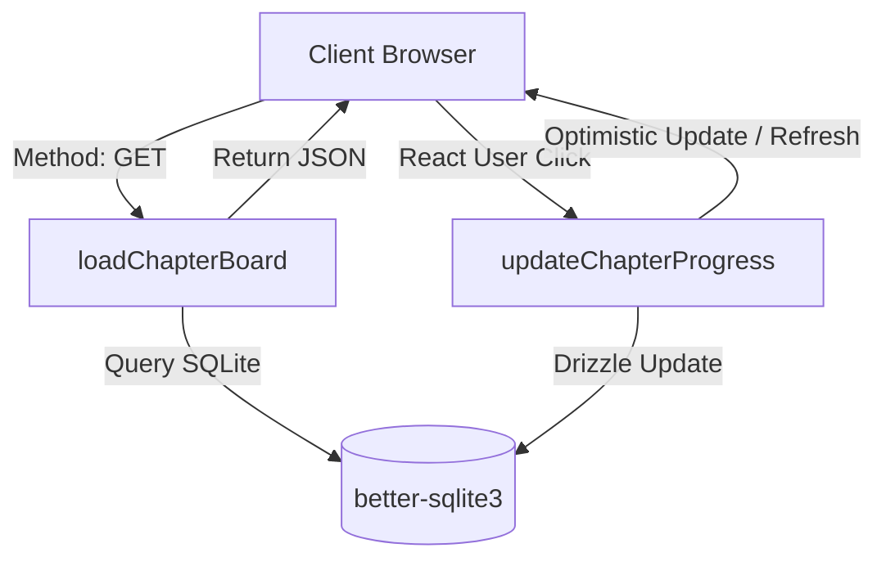

# Architecture Overview

This project is a personal Learning Management System (LMS) for **Sakthi** to track chapter-level study progress for the **NEET 2027** exam.

## Technology Stack

- **Framework**: [TanStack Start](https://tanstack.com/router/latest/docs/start/overview) (Server-side rendering, routing, and server functions).
- **Core Library**: [React 19](https://react.dev/) (Modern hook utilities, transitions, and state management).
- **Styling**: [Tailwind CSS v4](https://tailwindcss.com/) with Vanilla CSS.
- **Database**: [SQLite](https://sqlite.org/) (Local file-based SQL store, WAL mode enabled for performance).
- **ORM**: [Drizzle ORM](https://orm.drizzle.team/) (Type-safe SQL queries and schema modeling).
- **Development Tooling**: [Biome](https://biomejs.dev/) (Fast formatter, linter, and code organizer).

---

## Technical Flow & State Management

### Server Functions (`src/lib/chapter-progress.ts`)
1. **`loadChapterBoard`**:
   - Seeds any missing chapters based on static definitions in `chapter-catalog.ts`.
   - Fetches all records from the SQLite database.
   - Computes subject lanes (Physics, Chemistry, Biology) and maps DB records to their respective lanes.
2. **`updateChapterProgress`**:
   - Modifies specific column values (`notes`, `exercise`, `level1`, `level2`, `mb`, or `status`) in SQLite.
   - Timestamps changes using a Unix epoch generator.

### Local Client Updates
In `src/routes/index.tsx`, chapter changes use an optimistic react state toggle to keep interactions highly responsive. While a server-side mutations transaction is underway, the state is locked for the specific node, cycling through values smoothly.
