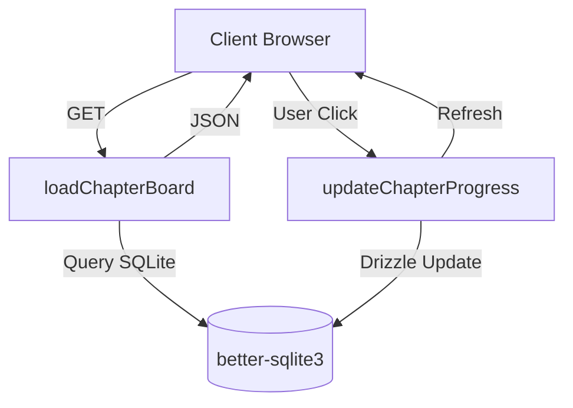

# Architecture Overview

LMS for NEET 2027 progress tracking.

## Technology Stack
- **Framework**: TanStack Start (SSR, routing, server functions)
- **Core**: React 19
- **Styling**: Tailwind CSS v4 with Vanilla CSS
- **Database**: SQLite (WAL mode)
- **ORM**: Drizzle ORM
- **Tooling**: Biome

---

## Technical Flow & State Management

```mermaid
graph TD
    Client[Client Browser] -->|GET| FetchFn[loadChapterBoard]
    FetchFn -->|Query SQLite| DB[(better-sqlite3)]
    FetchFn -->|JSON| Client
    Client -->|User Click| MutationFn[updateChapterProgress]
    MutationFn -->|Drizzle Update| DB
    MutationFn -->|Refresh| Client
```

### Server Functions (src/lib/chapter-progress.ts)
1. **`loadChapterBoard`**: Seeds missing chapters from src/lib/chapter-catalog.ts, fetches SQLite records, returns mapped lanes.
2. **`updateChapterProgress`**: Modifies columns (notes, exercise, level1, level2, mb, status) in SQLite with Unix timestamp.

### Client Updates
In src/routes/index.tsx, state updates cycle immediately on client. Node is locked during server transaction.
